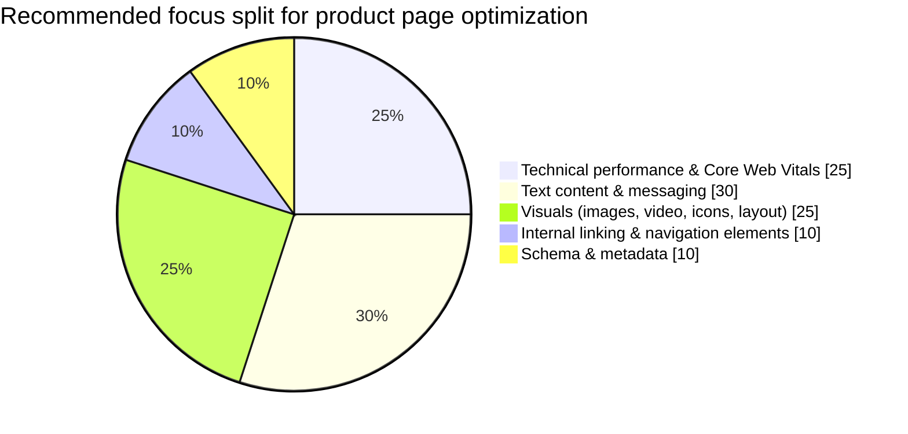
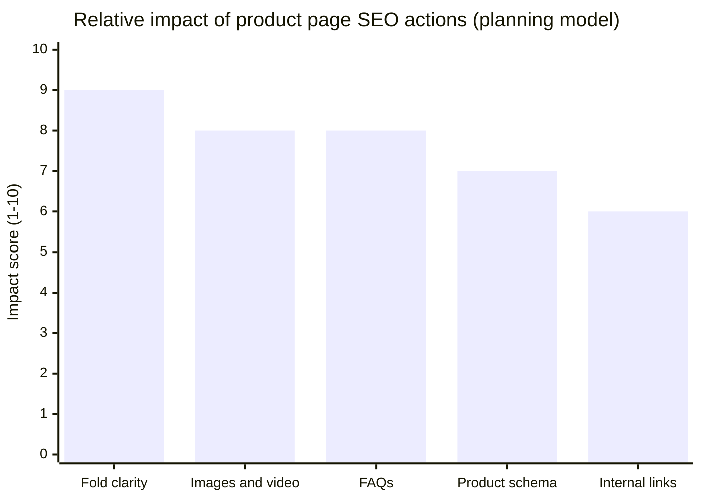

# Advanced Product Page SEO: Elevating Content Quality and Visuals for Higher Conversions

2026-01-20

---

Product pages are the "last mile" of ecommerce SEO: they have to earn rankings and close the sale. In 2023–2025, that bar got higher. Google's ecommerce guidance increasingly rewards pages that are easy to discover, fast, well-structured, and genuinely helpful, while real users decide in seconds based on clarity, images, trust, and friction. This tutorial shows how to upgrade product page SEO by improving content quality and visual experience, without losing technical rigor.

## 1) What "good" looks like now in ecommerce SEO (and why conversions follow)

Google's ecommerce SEO best practices emphasize a discoverable site structure, complete product information, strong performance, and structured data that helps Search understand product details and eligibility for rich results (price, availability, reviews) (Google Search Central: https://developers.google.com/search/docs/specialty/ecommerce, https://developers.google.com/search/docs/appearance/structured-data/product).

At the same time, review-related updates now evaluate quality at the page level, which raises the risk of thin, templated content on product detail pages. The practical takeaway is simple: if your product pages look "mass-produced", both rankings and conversion reliability tend to suffer.

From a business lens, even small UX and performance wins are meaningful because typical ecommerce conversion rates often sit in a broad 1%–4% range, leaving real upside for teams that improve product-page clarity, speed, and trust (Adobe benchmarks: https://business.adobe.com/blog/basics/ecommerce-conversion-rate-benchmarks).

**A modern product page needs to do four jobs at once:**
- Match search intent (so the right query lands on the right page).
- Answer decision questions fast (so users do not bounce back to results).
- Prove trust (so users feel safe to buy or inquire).
- Render cleanly for Googlebot (especially on JavaScript-heavy stacks).

## 2) Product page content quality: a practical framework you can scale

If you want product page SEO that drives revenue, write and structure content to reduce uncertainty. Here is a scalable framework you can apply across a catalog (then customize for flagship SKUs).

### The six pillars (what to include on the page)
1. **Clarity:** what it is, who it is for, and the primary use case.
2. **Completeness:** specs, dimensions, materials, compatibility, what is included, setup, and maintenance.
3. **Differentiation:** what makes this SKU better than alternatives (durability, certifications, support, lead times).
4. **Proof and trust:** detailed reviews, photos, test reports, policies, and brand information.
5. **Friction reduction:** shipping, returns, warranty, payment reassurance, and FAQs placed near buying actions.
6. **SEO structure:** descriptive headings, metadata, structured data, and internal links to relevant categories and guides.

### A "do this first" content checklist (use as a template)
| Page block | What to add or improve | Why it matters for product page SEO and conversion |
|---|---|---|
| Above the fold | One-sentence benefit summary, key specs in bullets, visible trust badges (shipping, warranty), clear CTA | Reduces pogo-sticking and hesitation, clarifies intent match fast |
| Description | Scenario-based copy (how it is used, who buys it, what problem it solves) | Helps avoid generic, repetitive text and strengthens helpfulness signals |
| Specs | A scannable table (dimensions, materials, compatibility, compliance) | Improves evaluation speed, reduces support tickets, supports long-tail queries |
| Reviews | Ask for outcome-focused reviews (fit, durability, results), encourage photos | Stronger trust and stronger page-level review usefulness |
| FAQs | Objection-handling questions (delivery time, compatibility, returns, bulk orders) | Removes friction close to purchase or inquiry |

**Tip for international sellers:** if you operate across APAC, the US, and Europe, align naming, specs, and compliance wording across locales, then localize the truly regional parts (voltage, certification labels, shipping timelines). This avoids duplicate confusion while still matching local intent.

## 3) Visuals that rank and convert: design your media like a sales argument

High-quality visuals are not decoration. They change how long users stay, what they understand, and whether they trust you. Research and CRO guidelines consistently show that clearer layouts, better product presentation, and friction reduction can lift conversion rates meaningfully (for UX and CRO principles, see: https://usabilitygeek.com/ecommerce-conversion-rate-optimization-guidelines/).

### What to implement on product pages (beyond "add more images")
- **A purposeful image set (often 6–10 images):**
  - multi-angle shots,
  - in-context usage,
  - close-ups of materials and connectors,
  - size reference or dimensional overlays,
  - "what is included" flat-lay,
  - proof images (packaging, QC, certifications where appropriate).
- **Short video where complexity is high:** demos, installation, or QC process are especially persuasive for technical or exporter catalogs.
- **Information design:** icons for key benefits, comparison blocks, and tables to compress decision-making time.

### Image SEO fundamentals that also help performance
- Use descriptive file names and alt text that describe the visible content and key attributes (Conductor best practices: https://www.conductor.com/academy/product-page-seo/).
- Serve modern formats (WebP/AVIF), compress, and lazy-load non-critical images to protect Core Web Vitals (Core Web Vitals overview: https://web.dev/vitals/).

## 4) Technical product page SEO: the foundations that make content and visuals count

Even great pages underperform if Google cannot reliably crawl, render, or understand them.

### Priority technical checks for product pages
- **Core Web Vitals and script discipline:** product pages often accumulate heavy galleries, reviews widgets, personalization, and chat scripts. Defer non-critical scripts, lazy-load below-the-fold media, and prevent layout shifts.
- **Variant and duplicate control (canonicals):** consolidate signals to a primary URL when variants do not represent distinct intent. This is especially important when color/size parameters create many near-duplicates.
- **JavaScript rendering readiness:** ensure product name, price, availability, primary image, and canonical are present in a way Googlebot can access. Validate with Search Console's URL inspection and follow JavaScript SEO guidance (https://developers.google.com/search/docs/crawling-indexing/javascript).
- **Structured data that matches visible content:** implement Product, Offer, Review (when eligible), and Breadcrumb markup, aligned with what users can see (https://developers.google.com/search/docs/appearance/structured-data/product, https://developers.google.com/search/docs/appearance/structured-data/review-snippet).

### A quick technical triage table (so you do not "fix everything")
| Issue type | Symptom | Usually worth prioritizing? | Why |
|---|---|---|---|
| Canonical/duplicate variants | Many similar URLs indexed, unstable rankings | Yes | Consolidates relevance and crawl focus |
| CWV regressions on PDP | Slow LCP, layout shifts near hero | Yes | Impacts both UX and performance signals |
| Missing Product structured data | No price/availability in rich results | Often yes | Better SERP presentation and clarity |
| Faceted crawl explosion | Millions of parameter URLs discovered | Yes | Protects crawl budget and index quality |
| Minor microcopy tweaks | Slightly different wording only | Sometimes later | Lower leverage than clarity, visuals, speed |

## 5) Connecting category page SEO, product page SEO, and measurement (so improvements compound)

Category page SEO and product page SEO should work as a system:
- **Category pages** act as intent hubs for broader queries and distribute internal link equity to important products.
- **Product pages** act as decision endpoints for high-intent, attribute-rich queries.

A simple rule: category pages help you get discovered; product pages help you get chosen.

### Internal linking pattern that scales
- Category pages should link to priority products with descriptive anchors (not "View").
- Product pages should link back to the parent category and to a curated set of related products (avoid overwhelming users).
- Guides and how-to content should link to the most relevant categories and products to support the full journey.

### What to measure (SEO plus conversion), per product URL
- Search Console: impressions, clicks, CTR, average position.
- Indexing: coverage and canonical consistency.
- Engagement: scroll depth, gallery interaction, FAQ opens.
- Conversion: add-to-cart, checkout initiation, inquiry submits, revenue per session from organic.

To help teams prioritize improvements, here is a simple "impact model" you can use in planning.

### How SeekLab.io supports this workflow (without chasing busywork)
SeekLab.io focuses on identifying what truly impacts growth, what can be deprioritized, and how to implement changes with clear technical guidance. For international teams, that often includes full-site crawling, Core Web Vitals diagnostics, indexing and rendering checks, schema enhancements, internal linking and semantic structure analysis, and multilingual architecture recommendations (including hreflang SEO where relevant). Content deliverables are designed to be industry-aligned and visually strong, so product pages do not feel generic or monotonous.

If you want a prioritized plan for your catalog, please [contact us](https://seeklab.io/contact). SeekLab.io operates with teams and legal entities in Singapore and Shanghai, plus a BD team in Dubai, supporting projects across APAC, the US, and Europe.